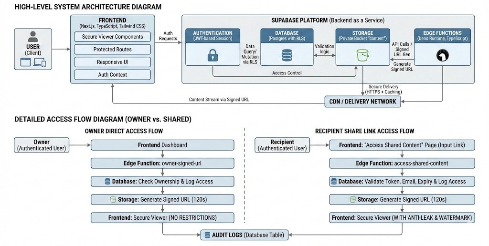
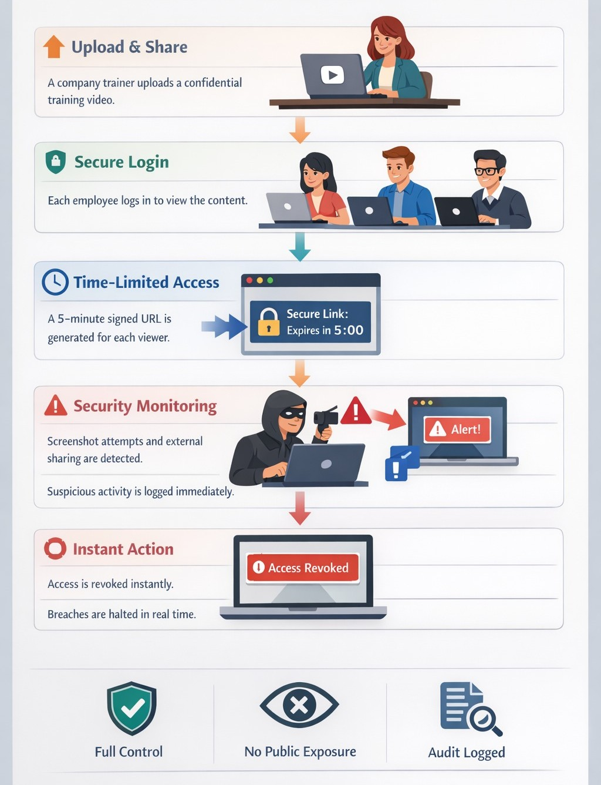

# Safe-Stream-Share 🛡️

Safe-Stream-Share is an industry-grade secure content delivery and management platform. It allows users to securely upload, manage, and distribute sensitive digital assets (Videos, PDFs, Images, and Audio) with granular access control and expiration-based sharing.

---

Link to website - [safe-stream-share](secure-content-share.vercel.app)
    
Youtube Demo - [youtube-demo](https://youtube.com)

## 🏗️ System Architecture

### **High-Level Flow**



1. **Authentication**: Secure JWT-based auth via Supabase.
2. **Ingestion**: Multi-format upload via signed URLs and Edge Functions.
3. **Distribution**: Tokenized sharing links with email whitelisting.
4. **Security**: Row Level Security (RLS) and auto-expiring tokens.

---

## 🛠️ Core Functionalities

### **1. Authentication & Identity**

- **Signup/Login**: Email-based authentication with mandatory email confirmation.
- **Profile Management**: Automatic profile creation via database triggers upon user registration.
- **Security Features**: Rate limiting on auth attempts and automated password reset flows.

### **2. Secure Content Management**

- **Multi-Format Support**:
  - **Video**: MP4, WebM, MOV.
  - **Audio**: MP3, WAV, M4A.
  - **Images**: JPEG, PNG, WebP, GIF.
  - **Documents**: PDF, DOCX, PPTX, TXT.
- **Category-Based Organization**: Automatic sorting into videos, audios, images, and documents.
- **Owner Dashboard**: Comprehensive view of uploaded assets with metadata (size, type, creation date).

### **3. Controlled Sharing System**

- **Tokenized Links**: Generation of unique, non-guessable share tokens.
- **Email Whitelisting**: Restrict content access to specific email addresses.
- **Expiry Management**: Set custom expiration times (in minutes) for shared links.
- **Access Tracking**: Detailed logging of every access event (IP, User Agent, Timestamp).

---

## � User Story & Workflow

### **User Journey**



Safe-Stream-Share is designed with the user in mind, ensuring a seamless journey from asset upload to secure distribution. The workflow emphasizes security without compromising on user experience.

---

## �📂 Technical Implementation Details

### **Database Schema**

- **`profiles`**: Stores extended user information.
- **`contents`**: Central registry for all uploaded files and their metadata.
- **`share_links`**: Manages the lifecycle of shared content tokens.
- **`access_logs`**: Audit trail for all content interactions.

### **Key Edge Functions**

- **`upload-content`**: Handles metadata registration and secure storage path generation.
- **`generate-share-link`**: Creates secure, restricted access tokens for content.
- **`access-shared-content`**: Validates tokens, whitelists, and expiration before granting temporary access.

---

## 🚀 Deployment Guide

### **Frontend (Vercel)**

1. Connect repository to Vercel.
2. Set Environment Variables:
   - `VITE_SUPABASE_URL`
   - `VITE_SUPABASE_PUBLISHABLE_KEY`
3. Vercel uses the included `vercel.json` for SPA routing support.

### **Backend (Supabase)**

1. Run migrations in `supabase/migrations`.
2. Deploy Edge Functions: `supabase functions deploy [function-name]`.
3. Configure Storage Bucket: Create a bucket named `content` with RLS enabled.

---

## 💻 Local Development

```bash
# Clone and Install
git clone <repo-url>
cd safe-stream-share
npm install

# Setup Environment
cp .env.example .env # Add your Supabase credentials

# Start Development
npm run dev
```

---

## 📊 Logic Flow Diagram

> [!IMPORTANT] > **Access Validation Logic**:
>
> 1. Request arrives with `share_token`.
> 2. System checks if token exists in `share_links`.
> 3. System verifies `is_active = true` and `expires_at > now()`.
> 4. System checks if user's email is in `allowed_emails`.
> 5. If all pass, generate temporary signed URL for Storage object.

---

## 🛡️ Security Architecture

- **RLS (Row Level Security)**: Ensures users can only ever see their own metadata.
- **Storage Policies**: Restricts file access at the storage level using `auth.uid()`.
- **JWT Validation**: All Edge Functions validate the user's Bearer token before processing.
- **Audit Logs**: Immutable records of every access attempt, successful or denied.

